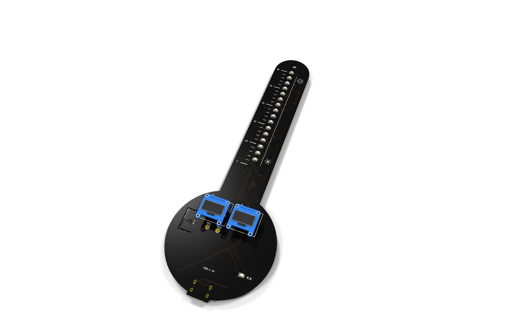
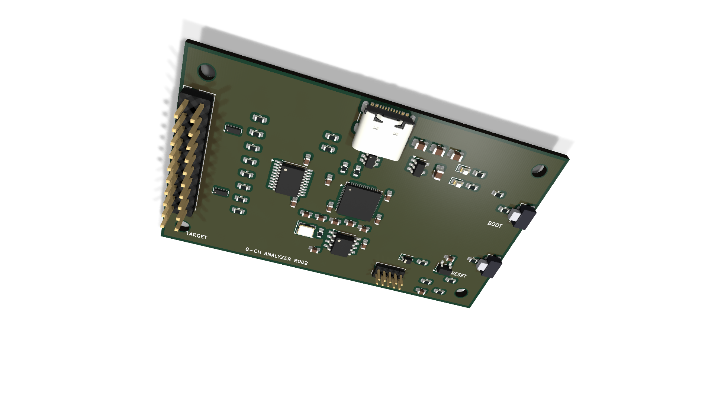
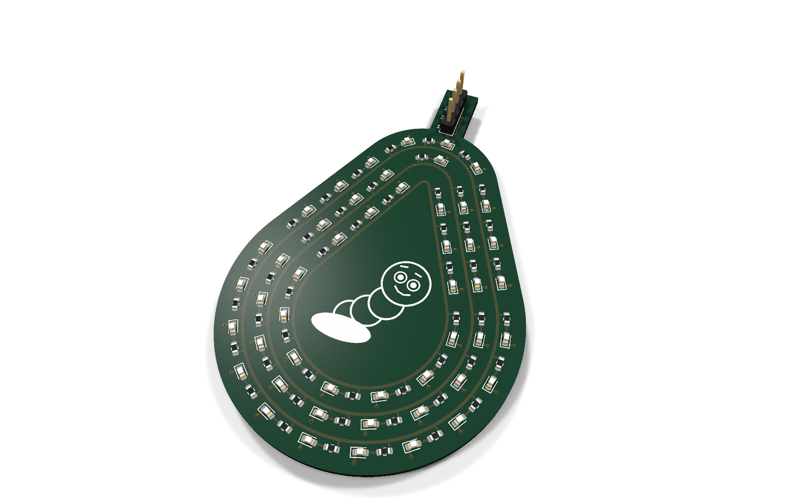
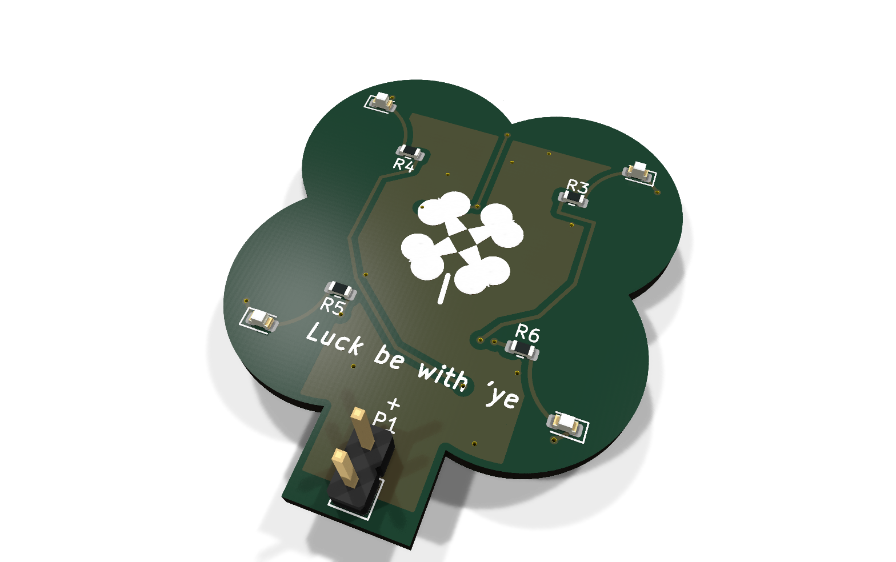
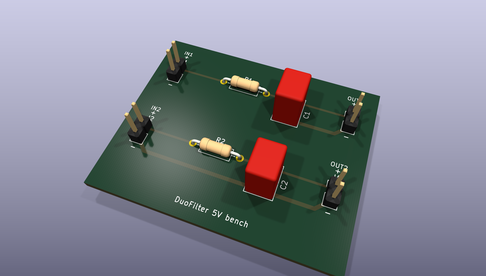
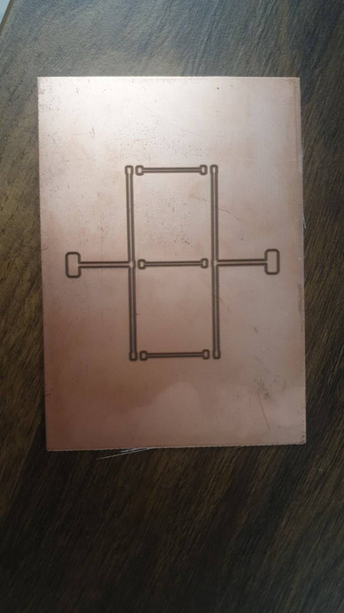

# PCBSmith

PCBSmith is an open-source tool for designing printed circuit boards. The long-term goal is to describe a circuit in plain language and get a checked schematic, board layout and manufacturing files. Today it combines a schematic editor prototype with KiCad-based workflows for automatic routing, design review and laser-fabricated boards.

It is under active development. The current tools support supervised engineering work: component choices, design decisions and physical testing still need a person.

[Board gallery](docs/showcase/README.md) · [Get started](#get-started) · [Design workflow](docs/production-usage.md) · [Development](docs/development.md)

## Boards made with PCBSmith

These are retained images from actual design projects. Captions distinguish CAD results, work in progress and physical fabrication.

<table>
<tr>
<td width="50%" align="center">
<a href="docs/showcase/README.md#thermometer"></a><br>
<strong>Thermometer</strong><br>
63 components, 53 routed nets and a custom outline. Accepted CAD proof; the render uses some proxy models.
</td>
<td width="50%" align="center">
<a href="docs/showcase/README.md#protocol-analyzer"></a><br>
<strong>Eight-channel protocol analyzer</strong><br>
A more complex controller and input-interface study. Placement prototype; routing and review remain open.
</td>
</tr>
<tr>
<td width="50%" align="center">
<a href="docs/showcase/README.md#pear-worm"></a><br>
<strong>Pear Worm</strong><br>
LED rings following a pear outline, with custom silkscreen. Historical design prototype.
</td>
<td width="50%" align="center">
<a href="docs/showcase/README.md#lucky-clover"></a><br>
<strong>Lucky Clover</strong><br>
A compact LED board with a four-lobed outline. Historical design prototype.
</td>
</tr>
<tr>
<td width="50%" align="center">
<a href="docs/showcase/README.md#duofilter"></a><br>
<strong>DuoFilter</strong><br>
Two-sided RC filter: automatic routing, a resistor revision and a checked CAD handover.
</td>
<td width="50%" align="center">
<a href="docs/showcase/README.md#tracelimits"></a><br>
<strong>TraceLimits — recent laser test</strong><br>
0.15–1.00 mm traces, a six-net corner test and two isolation widths. CAD handover complete; process measurements pending.
</td>
</tr>
</table>

The [full gallery](docs/showcase/README.md) includes routing views, laser-artwork comparisons and a two-sided plated-hole test coupon.

### From CAD to copper

<p align="center">
<a href="docs/showcase/README.md#physical-laser-test"></a>
</p>

An early single-sided laser test, photographed by the builder. The builder reported that the process worked and requested wider isolation channels for the next tests. This is a physical fabrication result; the newer trace-width and plating coupons are still awaiting measurements.

## What it can do today

- **Plan and edit circuits:** a schematic editor prototype, structured project data, component catalogs and CLI tools.
- **Work with KiCad:** native schematics and PCB files, component and footprint checks, electrical/design-rule checks, and 2D/3D review images.
- **Route boards automatically:** pinned Freerouting is the default for ordinary board jobs, with placement review and bounded retries.
- **Revise an existing design:** local board edits and reviewed component substitutions, including supported SMD replacements in the same footprint.
- **Prepare a handover:** editable vector floorplans, an interactive HTML BOM, Gerber/drill exports and recorded checks tied to the delivered board.
- **Prepare laser artwork:** single- and two-sided isolation SVG/PNG, pad-only coating-removal masks, and comparisons between retained background copper and locally cleared areas.

The main fabrication scope is single- and two-sided boards. Laser CAM currently supports documented straight-track/simple-pad geometry; unsupported cases are reported. See [current scope and limits](docs/current-state.md) for the details. A clean CAD check does not establish component fit, circuit operation or a qualified fabrication process.

## Get started

The maintained development setup is **Python 3.12.12**, **uv 0.11.23** and **KiCad 10** with its symbol and footprint libraries. See [development setup](docs/development.md) for native-tool paths, optional dependencies and verification.

```powershell
git clone https://github.com/IgorCulafic/PCBSmith.git
cd PCBSmith
uv sync --frozen --all-extras --python 3.12.12
uv run --frozen --all-extras pcbsmith-gui
```

`pcbsmith-gui` opens the schematic editor prototype. Native board generation, review, routing and delivery use the separate [production CLI workflow](docs/production-usage.md).

To see CLI commands or run the standard developer checks:

```powershell
uv run --frozen --all-extras pcbsmith --help
uv run --frozen --all-extras python -B tools/verify.py --output .pcbsmith/verification/first-run
```

Choose a new verification output directory for each run. The standard checks cover the dependency lock, lint, types, architecture, workflow entry points and ordinary tests. The optional deep profile also requires live KiCad/ngspice tools.

## How a board moves through the workflow

1. Review the brief, parts, footprints and electrical requirements.
2. Create and inspect an editable, dimensioned vector floorplan.
3. Prepare the KiCad schematic and placement, then run the automatic router.
4. Check electrical rules, board rules, connectivity and the visual result.
5. Package the checked revision with its BOM, drawings and requested manufacturing files.

The workflow records failures and preserves earlier revisions. Actual fabrication, assembly and bench measurements remain separate steps.

## Documentation and contributing

- [Production usage](docs/production-usage.md): supported board creation, edits, routing and handover.
- [Development](docs/development.md) and [contributing](CONTRIBUTING.md): setup, verification and contribution boundaries.
- [Current state](docs/current-state.md) and [implementation records](docs/implementation/README.md): present scope and engineering detail.
- [Project history](docs/cli-foundations.md): the original headless Phase 0 CLI and architectural foundations.
- [Latest public software update](docs/github-update-2026-10-02.md): what was published and how it was checked.

## License

PCBSmith is licensed under [AGPL-3.0-or-later](LICENSE). Bundled KiCad library assets retain their own terms; see [third-party notices](THIRD_PARTY_NOTICES.md).
