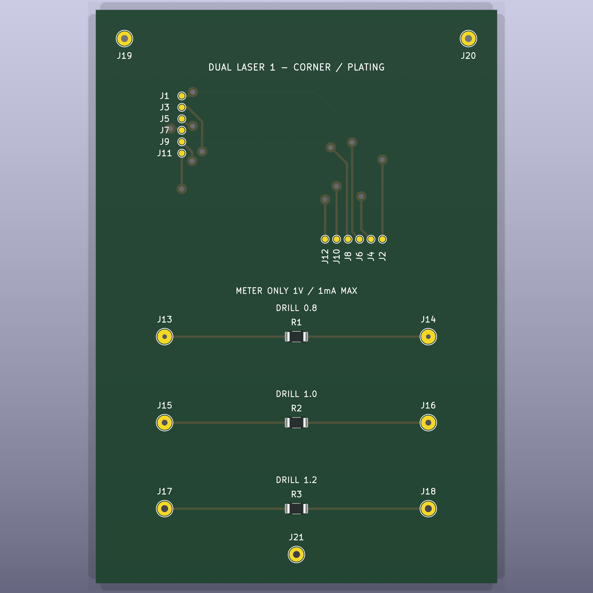

# Board gallery

[Back to PCBSmith](../../README.md)

A selection of custom outlines, circuit designs and fabrication tests made during
PCBSmith's development. All images are retained CAD/CAM outputs except the
explicitly labelled photograph. Older examples used earlier workflows; they are
not evidence that every current feature was used to create them.

| Example | What it demonstrates | Recorded stage |
| --- | --- | --- |
| [Thermometer](#thermometer) | Dense circuitry in a long, narrow custom outline | Accepted R005 CAD proof; R006 visualization |
| [Protocol analyzer](#protocol-analyzer) | Eight-channel interface and controller placement | R002 placement prototype; review/routing open |
| [Pear Worm](#pear-worm) | LED placement following an organic outline | Historical design prototype |
| [Lucky Clover](#lucky-clover) | Four-lobed board edge and custom silkscreen | Historical design prototype |
| [DuoFilter](#duofilter) | Two-sided routing and a preserved-layout component revision | CAD handover passed |
| [TraceLimits](#tracelimits) | Trace widths, close bends and alternative laser clearances | CAD handover passed; measurements pending |
| [DualLaser1](#duallaser1) | Two-sided artwork, registration and plated-hole experiments | CAD handover passed; plating qualification pending |
| [Physical laser test](#physical-laser-test) | Narrow isolation channels on real copper | Builder-supplied fabrication photograph |

## Thermometer

The accepted **R005** design fits **63 netlisted components and 53 routed nets**
into a **66 × 178 mm** outline with a **24 mm stem** and **60 mm bulb**. The circuit
combines an ESP32-C3, an SHT31 sensor, two OLED module connections and an LED column.
The retained result has 567 track segments, 99 vias and no unrouted connections.
Its recorded KiCad DRC and electrical checks passed.

The image shows **R006**, a visualization-only derivative with unchanged copper.
The OLED and sensor models include proxies, so the render does not establish
purchased-part fit. R005 used the legacy router; it is a historical CAD
proof-of-concept rather than a benchmark of today's Freerouting workflow.
Physical circuit operation is not claimed here.

[Inspect the R005 routing image](images/thermometer-r005-routing.png).

## Protocol analyzer

The **eight-channel analyzer R002** explores a denser technical layout: a target
input connector, interface circuitry, controller, USB connection, clock, debug
header and controls. It shows the component-placement and 3D-review side of the
project.

**Work in progress:** this is a placement prototype. USB orientation, compaction,
placement correction and routed qualification remain open. The populated render
must not be read as a completed routing or fabrication result.

## Pear Worm

A pear-shaped board with LED rings that follow the outline and a worm graphic in
the silkscreen. It demonstrates custom board edges, repeated component placement
and artwork carried into the CAD view.

This is the retained **R001 historical design prototype**. Its archived review
bundle still requests human review; it is shown as a design example, not a newly
qualified manufacturing package.

## Lucky Clover

A small LED board whose four-lobed outline and silkscreen are part of the design.
The component arrangement follows the leaves and keeps the connector on the stem.

This is the retained **R001 historical design prototype**. As with Pear Worm,
its archived review bundle requests human review; no new board acceptance is
implied by adding the render to this gallery.

## DuoFilter

A **50 × 40 mm**, two-sided passive RC filter with two independent signal channels
and a common ground. R1 is **2.2 kΩ**, R2 is **3.3 kΩ**, and both capacitors are
**100 nF**. Nominal unloaded cutoff frequencies are approximately **723 Hz** and
**482 Hz**.

Freerouting produced **12 front and 8 back track segments, with no vias**.
The R2 revision changed its value from 2.2 kΩ to 3.3 kΩ while preserving copper.
The delivered revision passed its native CAD checks and handover, and includes
an editable floorplan and interactive BOM.

Part fit, assembly and measured filter response remain physical tests. The green
finish in the render is illustrative; the home-fabrication brief specifies no
physical solder mask or silkscreen.

## TraceLimits

The recent **70 × 100 mm**, front-copper-only coupon tests eight straight widths
from **0.15 to 1.00 mm**, plus six corner-test nets from **0.15 to 0.60 mm**. Five
traces follow the full parallel bend; the thickest inner path has an additional
branch/turn. The measured CAD gap between adjacent tracks reaches **0.20 mm**.

The same design has **0.5 mm and 0.8 mm** isolation variants, each offered with
background copper retained or with the crowded corner region cleared. Narrow
channels remove copper around the conductors instead of clearing the entire
blank. The already-close functional trace gaps remain 0.20 mm; the wider isolation
values describe separation from surrounding unused copper.

Black areas in these CAM previews indicate copper removal. They are comparison
images, not scale-controlled files to send to a laser. The actual delivery also
contains dedicated SVG/PNG removal artwork, pad-only coating masks, an editable
vector floorplan, an interactive BOM and test instructions.

All **16 nets** were automatically routed with **46 segments and no vias**. Native
CAD checks and handover passed. The trace widths are test targets, not a claim
that the laser process can already reproduce them reliably.

## DualLaser1

A **70 × 100 mm**, two-sided corner/plating coupon for the next fabrication step.
It combines a corner-routing area with **0.8, 1.0 and 1.2 mm drilled-hole trials**
and three registration positions. The CAD has **12 routed nets, 41 segments,
12 vias and 21 drill positions**.

Its handover includes front and rear laser artwork, drill files, contact-pad
coating masks, vector planning and an interactive BOM. It passed the recorded
CAD and handover checks. Through-hole plating continuity, finished-hole diameter,
plating shrinkage and front/back alignment still require physical measurements.

## Physical laser test

This is the builder's photograph from an early single-sided test, rather than a
render. The builder reported that it worked well and asked for wider separation
around the traces. That feedback led to the subsequent 0.5/0.8 mm comparisons and
trace-width/corner stress tests.

The photograph documents one fabrication sample. It does not by itself establish
electrical continuity, insulation resistance, repeatability or the minimum
reliable trace width, and it is not a photograph of the newer TraceLimits or
DualLaser1 coupon.

## Image provenance

The images are copied unchanged from the retained revisions named above. The
[image manifest](image-manifest.json) records filenames, dimensions and SHA-256
hashes. No native PCB was changed or rerendered for this gallery. The gallery
contains visual examples and technical notes; it is not a replacement for the
revision-specific manufacturing packages and their test instructions.
