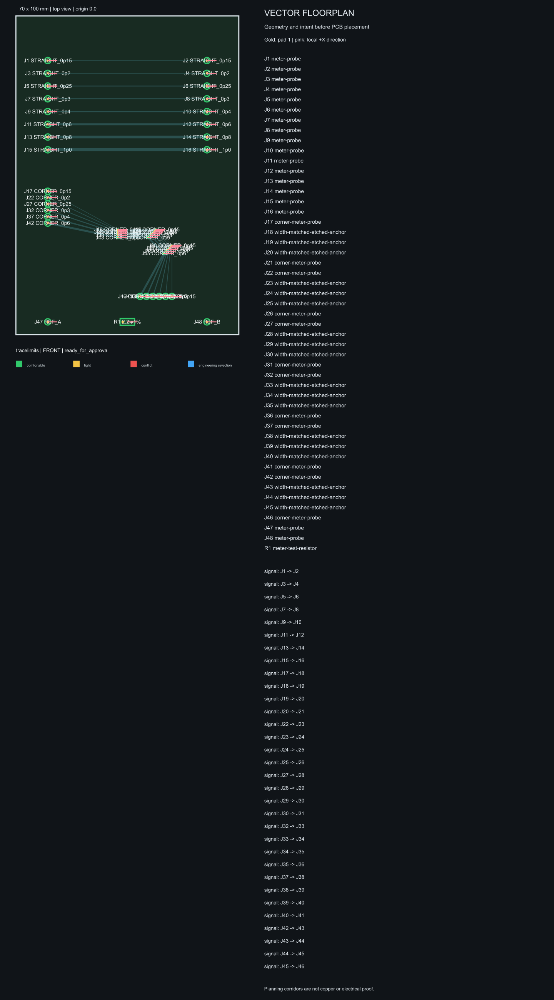
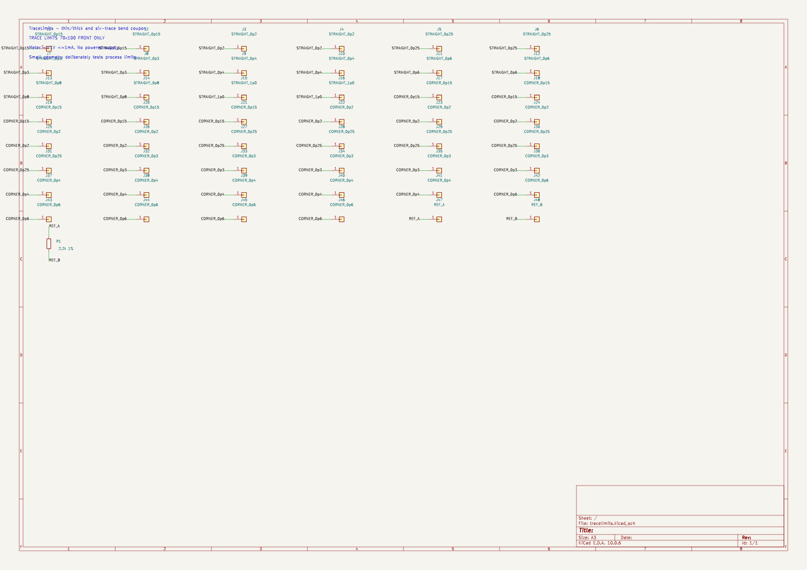
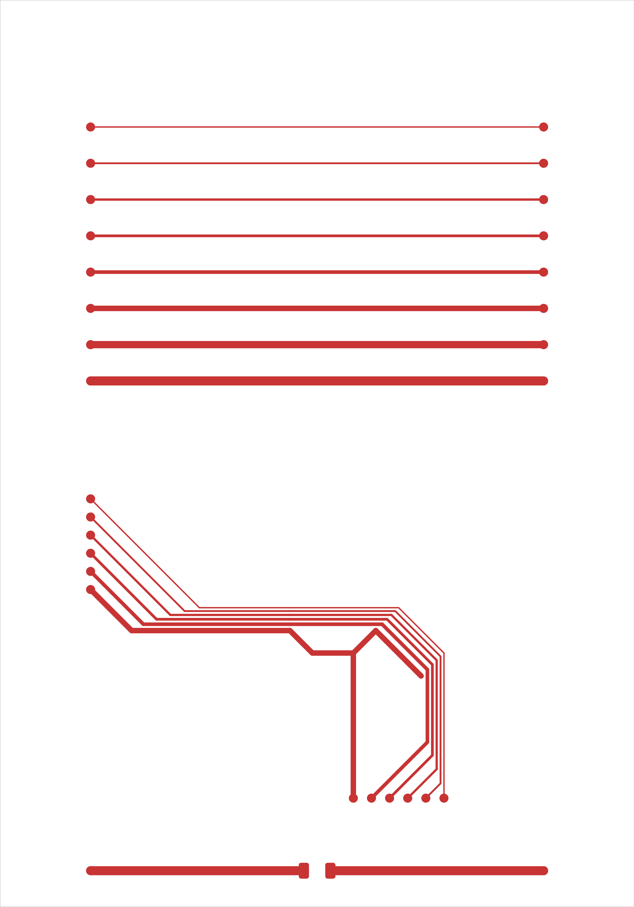
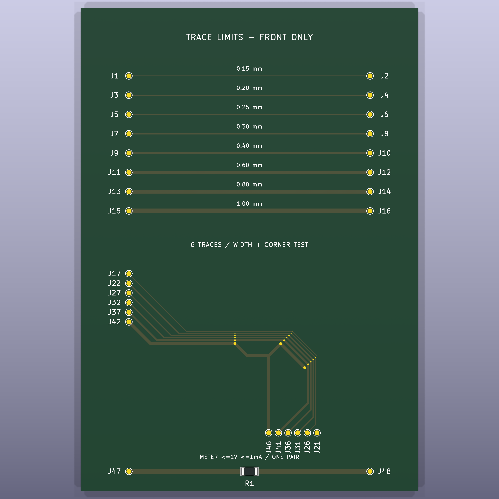
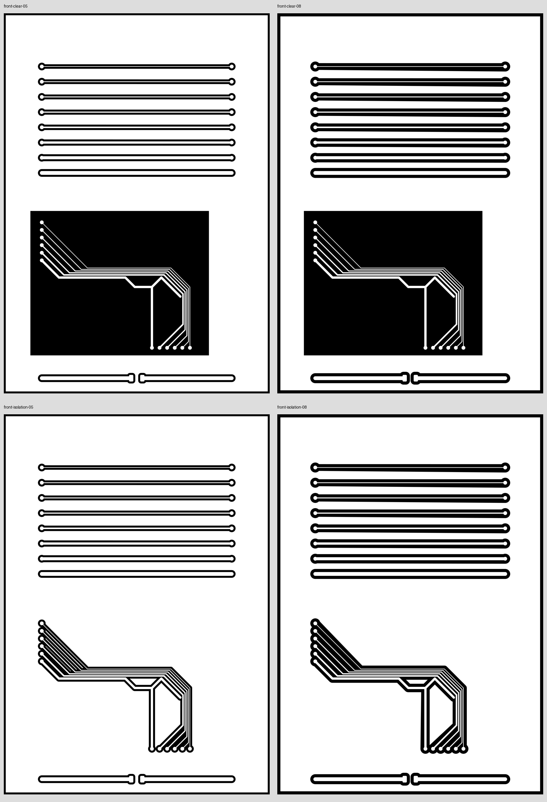
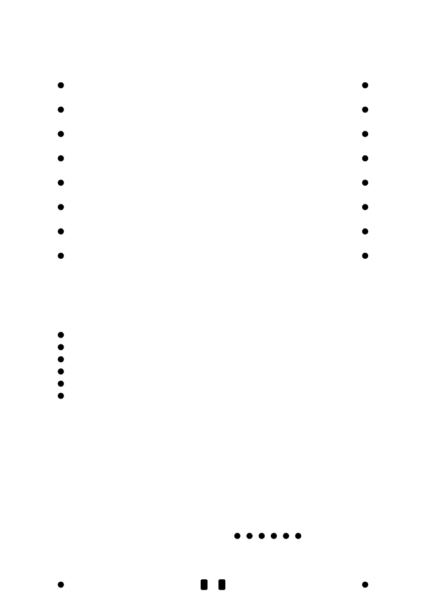
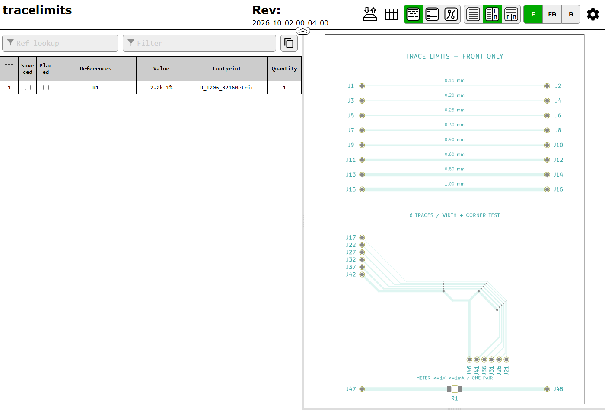

# From concept to board: TraceLimits

[Back to PCBSmith](../../README.md) · [Board gallery](README.md)

This follows one actual project through development: the **70 × 100 mm TraceLimits
laser-test coupon**. The concept plan, schematic, copper, 3D view, CAM and BOM
below all belong to that project. It is a fabrication test coupon, so most of
its electrical design consists of named probe connections rather than a powered
circuit.

**Brief → vector concept → schematic and placement → automatic routing → checks
and 3D review → fabrication files and BOM → physical testing.**

## 1. Turn the request into a testable brief

The request was to discover the practical limits of a direct-copper laser
process: thin and thick straight traces, five or six closely spaced traces
turning a corner, and a comparison of narrow isolation with a locally cleared
background. The available blank was 70 × 100 mm, with copper on one face.

The resulting plan uses eight straight widths from 0.15 to 1.00 mm, six corner
nets from 0.15 to 0.60 mm, probe contacts and a 2.2 kΩ reference-resistor section.
The 0.5/0.8 mm isolation variants compare separation from surrounding unused
copper; close functional gaps in the corner remain 0.20 mm.

## 2. Review the vector concept before PCB placement

The editable concept establishes the board size, probe positions, trace-test
regions and intended routing corridors before native placement. It records
layout intent: the guide lines are not routed copper. Its dense label/key area
is retained as generated, so open the full image or vector to inspect it.

[Download the original editable SVG floorplan](assets/tracelimits-floorplan.svg).

## 3. Express the electrical connections in a schematic

The native schematic names the straight and corner test nets and connects the
reference resistor. Matching net labels establish connectivity even where the
page has no long drawn wire. Footprints and their pad mappings are then used for
PCB placement.

This illustration is a read-only KiCad 10.0.6 SVG export of the delivered
schematic, made for this walkthrough. The original schematic bytes are unchanged.
[Open the schematic SVG](images/trace-limits-schematic.svg) to zoom into the labels.

## 4. Route the placed board

The placed anchors give the automatic router its geometry. Pinned Freerouting
connected all **16 nets** with **46 track segments and no vias**, entirely on the
front copper layer. The lower bend has five full parallel paths and an additional
branch/turn on the thickest inner net. This is the retained routed-copper view,
not a concept sketch or a simulated route.

## 5. Check the design and inspect the board

Native electrical rules, board design rules, unconnected-item and schematic/PCB
parity checks reported zero findings for the delivered revision. The final
review includes **37 recorded visual decisions**, followed by release and
handover checks. Width legends and probe references help make the physical
coupon usable on the bench.

The 3D finish is a review visualization. It does not mean that the laser-made
board has green solder mask or printed silkscreen. Earlier attempts and a
publication-metadata correction remain part of the project history; completion
was not treated as a fresh, failure-free run.

## 6. Create the laser artwork and coating masks

Black is copper to remove. The four variants compare 0.5/0.8 mm isolation with
retained background copper or a cleared corner region. The close corner lets
the builder compare the behavior of narrow channels against full local copper
removal.

A separate mask opens only the **32 contact pads** after coating. It shares the
same physical canvas and origin as the laser artwork. These README images are
illustrations; fabrication uses the scale-controlled exports and instructions
in the revision-specific handover.

## 7. Hand over an inspectable board and BOM

The handover contains native KiCad files, the vector plan, recorded checks,
Gerbers, laser artwork, coating masks, a test guide and an interactive HTML BOM.
This coupon has one fitted resistor; the probe pads are board features rather
than purchased BOM parts.

[Download the standalone interactive BOM](assets/tracelimits-ibom.html?raw=1)
and open it locally in a browser. GitHub displays HTML as source rather than
running the viewer inside the README. The example is the unchanged delivered
HTML, generated with **InteractiveHtmlBom 2.11.2**; its [MIT license](assets/InteractiveHtmlBom-LICENSE.txt)
is included. The screenshot shows the file loaded in headless Edge; it does not
claim that every viewer interaction was tested in this documentation update.

## 8. Measure the physical result and feed it back

The next step is to fabricate the alternatives and measure continuity, shorts,
trace survival, isolation quality and coating alignment. Those results determine
which trace widths and clearances should be used for the next real circuit.

**TraceLimits physical qualification is still pending.** The earlier
[builder photograph](README.md#physical-laser-test) is a different coupon. Its
reported success and request for wider separation helped motivate this test,
but it cannot substitute for measurements on the new design.

## Source identity

The walkthrough uses the delivered PCB with SHA-256
`effaf7f76cc40f310267b2dd8447720c1cc12c712776f76845aabae1184c0650`
and schematic
`80500a3a5cc650fd6fdcebee66b855fa987628ec1408524354986f418182eb86`.
The [media manifest](image-manifest.json) distinguishes retained images from the
new documentation-only schematic illustration and BOM screenshot. No native
board, routing or manufacturing instructions were edited for this page.
