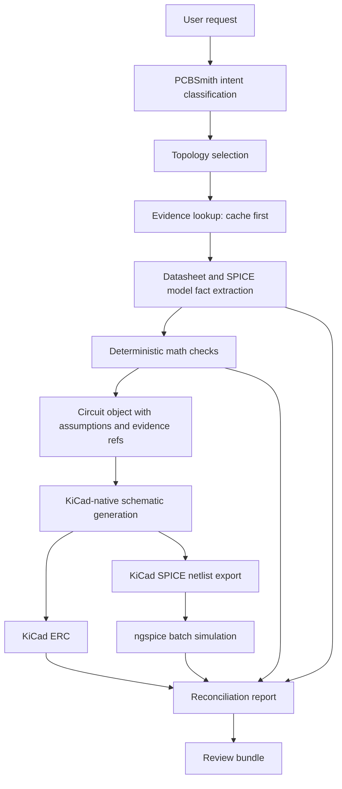

# PCBSmith KiCad And ngspice Authority Design

Date: 2026-05-19

## Purpose

PCBSmith should not become a parallel EDA or simulation engine. It should be an AI
companion that plans, explains, checks, and revises circuit work while delegating
authoritative EDA and simulation facts to established tools.

For the next architecture slice:

- KiCad is the schematic, netlist, ERC, PCB, DRC, and library authority.
- ngspice is the circuit simulation authority.
- Octopart, Nexar, manufacturer pages, datasheets, app notes, reference designs, and
  SPICE model files are evidence sources.
- PCBSmith is the orchestrator, evidence cache, evaluator, and review-bundle writer.

This corrects the earlier failure mode where PCBSmith could jump from a prompt to
generated output without enough topology evidence, deterministic math, KiCad-native
schematic evidence, or simulation evidence.

## Local Tool Facts

Checked locally during this design pass:

- KiCad CLI: `C:\Program Files\KiCad\10.0\bin\kicad-cli.exe`
- KiCad version: `10.0.2`
- KiCad commands available:
  - `kicad-cli sch erc`
  - `kicad-cli sch export netlist --format spice`
- Standalone ngspice: `D:\AI\PCB designer\Spice64\bin\ngspice_con.exe`
- Standalone ngspice version previously checked: `ngspice-46`

References:

- KiCad CLI documentation: https://docs.kicad.org/10.0/en/cli/cli.html
- KiCad SPICE overview: https://kicad.io/discover/spice/
- ngspice batch-mode documentation:
  https://nmg.gitlab.io/ngspice-manual/analysesandoutputcontrol_batchmode.html
- Nexar and Octopart data alignment note:
  https://support.nexar.com/support/solutions/articles/101000541169-differences-between-octopart-com-and-nexar-api-data

## Authority Model

PCBSmith must label every result by the authority that produced it.

| Authority | Owns | Does not prove |
| --- | --- | --- |
| PCBSmith internal logic | Intent classification, topology selection, deterministic calculators, preflight assumptions, orchestration | KiCad correctness, real component suitability, analog behavior, manufacturable PCB |
| Evidence sources | Component facts, datasheet locators, manufacturer recommendations, SPICE model availability, package metadata | That the generated schematic is correct or that simulation passed |
| KiCad | Native schematic syntax, symbol/library behavior, netlist export, ERC, PCB/DRC when boards exist | Analog correctness, datasheet compliance, LED brightness, regulator stability |
| ngspice | Simulated behavior for the netlist and models it actually receives | PCB layout correctness, real-world component availability, schematic ERC correctness |
| Reconciliation layer | Agreement or disagreement between PCBSmith expectations, KiCad-exported data, ngspice measurements, and evidence facts | New engineering facts beyond its inputs |

No single authority can mark a circuit as ready. Readiness is an aggregate status
that requires the relevant authorities to pass and the review bundle to record the
evidence.

## Target Data Flow



The key rule is that ngspice should simulate the SPICE netlist exported from the
KiCad schematic whenever that path is available. PCBSmith-rendered SPICE netlists
may remain useful as early test fixtures, but they are not enough for an authority
claim once KiCad export exists for that circuit.

## Review Bundle Shape

The current review bundle already records simulation evidence. The next authority
slice should either bump the bundle schema to `pcbsmith-circuit-review-bundle-v2`
or add a tested compatibility path that clearly documents the new fields.

The target bundle should include:

```json
{
  "schema": "pcbsmith-circuit-review-bundle-v2",
  "intent": {
    "id": "divider_highpass_led_indicator",
    "status": "supported"
  },
  "pcbs_internal": {
    "topology_id": "divider_highpass_led_indicator",
    "math_status": "warning",
    "assumptions": {},
    "findings": []
  },
  "evidence": {
    "status": "needs_datasheet_review",
    "items": []
  },
  "kicad": {
    "status": "not_run",
    "schematic_file": null,
    "erc_report": null,
    "spice_netlist": null,
    "findings": []
  },
  "ngspice": {
    "status": "not_run",
    "source_netlist": null,
    "measurements": {},
    "findings": []
  },
  "reconciliation": {
    "status": "not_run",
    "checks": []
  },
  "status": "needs_human_review"
}
```

The exact Python model can be smaller than this target during the first slice, but
it must preserve the authority separation: KiCad status must not be mixed with
ngspice status, and evidence status must not be treated as validation.

## Evidence Source Policy

Evidence must be cache-first and locator-based.

1. Before any API or web request, PCBSmith checks local manifests and cached files.
2. External lookup is allowed only for missing evidence needed by the selected
   topology or shortlisted parts.
3. Octopart or Nexar can be used for discovery, metadata, datasheet URLs, lifecycle,
   packaging, and availability.
4. Manufacturer datasheets, application notes, reference designs, official SPICE
   models, and official evaluation-board files are preferred over distributor pages
   for engineering facts.
5. Downloaded files are stored under a local ignored cache such as
   `ai_assets/datasheets/` or `ai_assets/spice_models/`.
6. Cached files need a manifest entry with source URL, retrieval time, checksum,
   part identity, and extracted facts.
7. Extracted facts must carry locators such as datasheet page, table, figure, or
   section. If the fact came from a PDF image or graph, it is marked as requiring
   multimodal review until extraction is verified.

## KiCad Integration Slice

The next implementation slice should not generate a board first. It should make
KiCad-native schematic output part of the validation path.

Minimum scope:

1. Add a KiCad discovery wrapper.
   - Checks `PCBSMITH_KICAD_CLI`.
   - Checks `kicad-cli` on PATH.
   - Checks `C:\Program Files\KiCad\10.0\bin\kicad-cli.exe`.
   - Records version output.
2. Add a KiCad command runner.
   - Runs subprocesses without shell string interpolation.
   - Captures stdout, stderr, return code, command, and artifact path.
   - Reports unavailable tools as `unavailable`, not as success.
3. Restore or rebuild minimal KiCad-native export for the voltage-divider,
   high-pass, LED-indicator slice.
   - Produces `.kicad_pro` and `.kicad_sch`.
   - May produce an empty or minimal `.kicad_pcb` only if honestly marked as not
     layout-complete.
   - Uses generated/local KiCad symbols only where mapped and tested.
4. Run KiCad ERC.
   - Command shape: `kicad-cli sch erc --format json --output <report> <schematic>`.
   - Include the raw JSON report in the bundle.
5. Export KiCad SPICE netlist.
   - Command shape:
     `kicad-cli sch export netlist --format spice --output <netlist> <schematic>`.
   - Include the exported netlist path in the bundle.
6. Run ngspice on the KiCad-exported SPICE netlist.
   - Reuse the generic `run_ngspice_batch` layer.
   - Parse measurements through the generic parser where possible.
   - Circuit-specific thresholds remain in a thin evaluator.
7. Add reconciliation checks.
   - Expected component references exist in KiCad-exported artifacts.
   - Expected nets or equivalent SPICE nodes are present.
   - Deterministic math expectations agree with ngspice measurements within
     defined tolerances.
   - Missing datasheet/model facts remain explicit review blockers.

## Status Rules

The top-level review status is derived from authority reports.

- `passed`: All required authority checks passed and no evidence or human-review
  blockers remain.
- `needs_human_review`: The circuit has usable artifacts, but at least one
  non-fatal blocker remains, such as demo-only components, missing datasheet facts,
  generic SPICE models, or incomplete layout evidence.
- `evidence_missing`: Required source facts or SPICE models are unavailable.
- `kicad_unavailable`: KiCad CLI is missing or cannot run.
- `kicad_failed`: KiCad ERC, export, or file parsing failed.
- `simulation_unavailable`: ngspice is missing or cannot run.
- `simulation_failed`: ngspice ran but required measurements failed or could not be
  extracted.
- `reconciliation_failed`: PCBSmith expectations disagree with KiCad-exported data
  or ngspice measurements.

For the first KiCad authority slice, `needs_human_review` is expected even if KiCad
ERC and ngspice pass, because component evidence is still generic and demo-only.

## Testing Strategy

Test order should follow the authority boundaries.

1. Unit tests for KiCad CLI discovery.
2. Unit tests for command construction with fake runners.
3. Unit tests for KiCad report parsing.
4. Unit tests for KiCad SPICE netlist export artifact handling.
5. Unit tests for review-bundle authority sections.
6. Integration smoke test using the installed KiCad CLI if available.
7. Integration smoke test: KiCad-exported SPICE netlist into ngspice.

Tests must make unsupported states explicit. A missing KiCad install should produce
an `unavailable` report and a review-bundle item, not a skipped success.

## Non-Goals For This Slice

- No general circuit generator.
- No automatic PCB layout claims.
- No routing or DRC readiness claim unless a real board is generated and checked.
- No bulk datasheet downloading.
- No claim that Octopart data alone justifies a part choice.
- No claim that ERC proves analog behavior.
- No claim that ngspice proves physical layout or manufacturability.

## Acceptance Criteria

The design is implemented for the voltage-divider, high-pass, LED-indicator slice
when:

1. PCBSmith writes a KiCad-native schematic for the slice.
2. KiCad ERC runs and its report is included in the review bundle.
3. KiCad exports a SPICE netlist from that schematic.
4. ngspice runs against the KiCad-exported SPICE netlist.
5. The review bundle records KiCad, ngspice, evidence, and reconciliation sections
   separately.
6. The top-level status remains honest and conservative.
7. Tests prove missing KiCad, failed ERC, missing SPICE export, failed simulation,
   and measurement mismatch paths.

