# Review pack: Thermometer_R005

Generated deterministically from the design's structured data
(roles, cards, nets, calculator outputs). Nothing in this file is
model-generated; every claim traces to code or evidence.

## Block diagram

```mermaid
graph LR
  J1["J1 usb_c_receptacle"]
  F1["F1 vbus_polyfuse"]
  RCC1["RCC1 cc1_pulldown"]
  RCC2["RCC2 cc2_pulldown"]
  U5["U5 ldo_regulator"]
  C5["C5 ldo_input_capacitor"]
  C6["C6 ldo_output_capacitor"]
  D17["D17 power_led"]
  R17["R17 power_led_resistor"]
  U1["U1 mcu_module"]
  C1["C1 module_bulk_capacitor"]
  C2["C2 module_bypass_capacitor"]
  REN1["REN1 enable_pullup"]
  CEN1["CEN1 enable_capacitor"]
  RS1["RS1 strap_pullup"]
  RS2["RS2 strap_pullup"]
  U2["U2 led_shift_register"]
  U3["U3 led_shift_register"]
  C3["C3 register_bypass_capacitor"]
  C4["C4 register_bypass_capacitor"]
  ROE1["ROE1 oe_pullup"]
  U4["U4 humidity_temperature_sensor"]
  C7["C7 sensor_bypass_capacitor"]
  RI1["RI1 i2c_pullup"]
  RI2["RI2 i2c_pullup"]
  RI3["RI3 i2c_pullup"]
  RI4["RI4 i2c_pullup"]
  J2["J2 oled_header"]
  J3["J3 oled_header"]
  R1["R1 led_series_resistor"]
  D1["D1 mercury_led"]
  R2["R2 led_series_resistor"]
  D2["D2 mercury_led"]
  R3["R3 led_series_resistor"]
  D3["D3 mercury_led"]
  R4["R4 led_series_resistor"]
  D4["D4 mercury_led"]
  R5["R5 led_series_resistor"]
  D5["D5 mercury_led"]
  R6["R6 led_series_resistor"]
  D6["D6 mercury_led"]
  R7["R7 led_series_resistor"]
  D7["D7 mercury_led"]
  R8["R8 led_series_resistor"]
  D8["D8 mercury_led"]
  R9["R9 led_series_resistor"]
  D9["D9 mercury_led"]
  R10["R10 led_series_resistor"]
  D10["D10 mercury_led"]
  R11["R11 led_series_resistor"]
  D11["D11 mercury_led"]
  R12["R12 led_series_resistor"]
  D12["D12 mercury_led"]
  R13["R13 led_series_resistor"]
  D13["D13 mercury_led"]
  R14["R14 led_series_resistor"]
  D14["D14 mercury_led"]
  R15["R15 led_series_resistor"]
  D15["D15 mercury_led"]
  R16["R16 led_series_resistor"]
  D16["D16 mercury_led"]
  TP1["TP1 test_point"]
  TP2["TP2 test_point"]
  GND((/GND))
  OE((/OE))
  SCL1((/SCL1))
  SDA1((/SDA1))
  VCC((/VCC))
  C1 --- GND
  C1 --- VCC
  C2 --- GND
  C2 --- VCC
  C3 --- GND
  C3 --- VCC
  C4 --- GND
  C4 --- VCC
  C5 --- GND
  C5 ---|/VBUSF| U5
  C6 --- GND
  C6 --- VCC
  C7 --- GND
  C7 --- VCC
  CEN1 --- GND
  CEN1 ---|/EN| REN1
  D1 --- GND
  D1 ---|/LK1| R1
  D10 --- GND
  D10 ---|/LK10| R10
  D11 --- GND
  D11 ---|/LK11| R11
  D12 --- GND
  D12 ---|/LK12| R12
  D13 --- GND
  D13 ---|/LK13| R13
  D14 --- GND
  D14 ---|/LK14| R14
  D15 --- GND
  D15 ---|/LK15| R15
  D16 --- GND
  D16 ---|/LK16| R16
  D17 --- GND
  D17 ---|/PWLED| R17
  D2 --- GND
  D2 ---|/LK2| R2
  D3 --- GND
  D3 ---|/LK3| R3
  D4 --- GND
  D4 ---|/LK4| R4
  D5 --- GND
  D5 ---|/LK5| R5
  D6 --- GND
  D6 ---|/LK6| R6
  D7 --- GND
  D7 ---|/LK7| R7
  D8 --- GND
  D8 ---|/LK8| R8
  D9 --- GND
  D9 ---|/LK9| R9
  J1 ---|/VBUS| F1
  J1 --- GND
  J1 ---|/CC1| RCC1
  J1 ---|/CC2| RCC2
  J1 ---|/DM| U1
  J1 ---|/DP| U1
  J2 --- GND
  J2 --- SCL1
  J2 --- SDA1
  J2 --- VCC
  J3 --- GND
  J3 ---|/SDA2| RI3
  J3 ---|/SCL2| RI4
  J3 --- VCC
  R17 --- VCC
  RCC1 --- GND
  RCC2 --- GND
  REN1 --- VCC
  RI1 --- SDA1
  RI1 --- VCC
  RI2 --- SCL1
  RI2 --- VCC
  RI3 --- VCC
  RI4 --- VCC
  ROE1 --- OE
  ROE1 --- VCC
  RS1 --- VCC
  RS2 --- VCC
  TP1 --- VCC
  TP2 --- GND
  U1 ---|/EN| CEN1
  U1 --- GND
  U1 ---|/SCL2| J3
  U1 ---|/SDA2| J3
  U1 --- OE
  U1 ---|/IO2| RS1
  U1 ---|/IO8| RS2
  U1 --- SCL1
  U1 --- SDA1
  U1 --- VCC
  U2 --- GND
  U2 --- OE
  U2 ---|/SEG1| R1
  U2 ---|/SEG2| R2
  U2 ---|/SEG3| R3
  U2 ---|/SEG4| R4
  U2 ---|/SEG5| R5
  U2 ---|/SEG6| R6
  U2 ---|/SEG7| R7
  U2 ---|/SEG8| R8
  U2 ---|/SER| U1
  U2 ---|/CAS| U3
  U2 ---|/RCLK| U3
  U2 ---|/SRCLK| U3
  U2 --- VCC
  U3 --- GND
  U3 --- OE
  U3 ---|/SEG10| R10
  U3 ---|/SEG11| R11
  U3 ---|/SEG12| R12
  U3 ---|/SEG13| R13
  U3 ---|/SEG14| R14
  U3 ---|/SEG15| R15
  U3 ---|/SEG16| R16
  U3 ---|/SEG9| R9
  U3 ---|/RCLK| U1
  U3 ---|/SRCLK| U1
  U3 --- VCC
  U4 --- GND
  U4 --- SCL1
  U4 --- SDA1
  U4 --- VCC
  U5 ---|/VBUSF| F1
  U5 --- GND
  U5 --- VCC
```

## Test plan

| # | Step | Procedure | Expected | Safety |
| --- | --- | --- | --- | --- |
| 1 | Rail bring-up | Connect USB-C; measure TP1 (3V3) against TP2 (GND) with the module unprogrammed. | 3.3V +/- 2%; power LED lit dim | USB power only. |
| 2 | USB programming | esptool chip_id over the native USB-Serial/JTAG; no BOOT button is fitted - esptool resets into download mode through the same interface. | ESP32-C3 detected, flash id read | USB power only. |
| 3 | Sensor readout | Firmware reads SHT31 at 0x44 on I2C bus 1; log temperature and humidity. | Plausible ambient values; CRC valid | USB power only. |
| 4 | Mercury column | Walk the LED column 1..16 via the 74HC595 chain; measure one series resistor's voltage drop. | Each LED ~5.4mA (0.27k x drop); column aligns with the printed scale ticks | USB power only. |
| 5 | Displays | OLED on bus 1 shows temperature, bus 2 shows humidity; verify both at 0x3C. | Both readouts update once per second | USB power only. |
| 6 | Thermal check | All LEDs on, displays active, WiFi OFF; measure the AP2112 case temperature after 10 minutes. | Rail current well under 426mA worst-case; LDO warm, not hot (< 60C case) | USB power only. |

## FMEA

| Ref | Role | Failure mode | Effect | Coverage |
| --- | --- | --- | --- | --- |
| J1 | usb_c_receptacle | No curated failure modes for this role | Unknown | Human review required |
| F1 | vbus_polyfuse | No curated failure modes for this role | Unknown | Human review required |
| RCC1 | cc1_pulldown | No curated failure modes for this role | Unknown | Human review required |
| RCC2 | cc2_pulldown | No curated failure modes for this role | Unknown | Human review required |
| U5 | ldo_regulator | No curated failure modes for this role | Unknown | Human review required |
| C5 | ldo_input_capacitor | No curated failure modes for this role | Unknown | Human review required |
| C6 | ldo_output_capacitor | No curated failure modes for this role | Unknown | Human review required |
| D17 | power_led | No curated failure modes for this role | Unknown | Human review required |
| R17 | power_led_resistor | No curated failure modes for this role | Unknown | Human review required |
| U1 | mcu_module | No curated failure modes for this role | Unknown | Human review required |
| C1 | module_bulk_capacitor | No curated failure modes for this role | Unknown | Human review required |
| C2 | module_bypass_capacitor | No curated failure modes for this role | Unknown | Human review required |
| REN1 | enable_pullup | No curated failure modes for this role | Unknown | Human review required |
| CEN1 | enable_capacitor | No curated failure modes for this role | Unknown | Human review required |
| RS1 | strap_pullup | No curated failure modes for this role | Unknown | Human review required |
| RS2 | strap_pullup | No curated failure modes for this role | Unknown | Human review required |
| U2 | led_shift_register | No curated failure modes for this role | Unknown | Human review required |
| U3 | led_shift_register | No curated failure modes for this role | Unknown | Human review required |
| C3 | register_bypass_capacitor | No curated failure modes for this role | Unknown | Human review required |
| C4 | register_bypass_capacitor | No curated failure modes for this role | Unknown | Human review required |
| ROE1 | oe_pullup | No curated failure modes for this role | Unknown | Human review required |
| U4 | humidity_temperature_sensor | No curated failure modes for this role | Unknown | Human review required |
| C7 | sensor_bypass_capacitor | No curated failure modes for this role | Unknown | Human review required |
| RI1 | i2c_pullup | No curated failure modes for this role | Unknown | Human review required |
| RI2 | i2c_pullup | No curated failure modes for this role | Unknown | Human review required |
| RI3 | i2c_pullup | No curated failure modes for this role | Unknown | Human review required |
| RI4 | i2c_pullup | No curated failure modes for this role | Unknown | Human review required |
| J2 | oled_header | No curated failure modes for this role | Unknown | Human review required |
| J3 | oled_header | No curated failure modes for this role | Unknown | Human review required |
| R1 | led_series_resistor | No curated failure modes for this role | Unknown | Human review required |
| D1 | mercury_led | No curated failure modes for this role | Unknown | Human review required |
| R2 | led_series_resistor | No curated failure modes for this role | Unknown | Human review required |
| D2 | mercury_led | No curated failure modes for this role | Unknown | Human review required |
| R3 | led_series_resistor | No curated failure modes for this role | Unknown | Human review required |
| D3 | mercury_led | No curated failure modes for this role | Unknown | Human review required |
| R4 | led_series_resistor | No curated failure modes for this role | Unknown | Human review required |
| D4 | mercury_led | No curated failure modes for this role | Unknown | Human review required |
| R5 | led_series_resistor | No curated failure modes for this role | Unknown | Human review required |
| D5 | mercury_led | No curated failure modes for this role | Unknown | Human review required |
| R6 | led_series_resistor | No curated failure modes for this role | Unknown | Human review required |
| D6 | mercury_led | No curated failure modes for this role | Unknown | Human review required |
| R7 | led_series_resistor | No curated failure modes for this role | Unknown | Human review required |
| D7 | mercury_led | No curated failure modes for this role | Unknown | Human review required |
| R8 | led_series_resistor | No curated failure modes for this role | Unknown | Human review required |
| D8 | mercury_led | No curated failure modes for this role | Unknown | Human review required |
| R9 | led_series_resistor | No curated failure modes for this role | Unknown | Human review required |
| D9 | mercury_led | No curated failure modes for this role | Unknown | Human review required |
| R10 | led_series_resistor | No curated failure modes for this role | Unknown | Human review required |
| D10 | mercury_led | No curated failure modes for this role | Unknown | Human review required |
| R11 | led_series_resistor | No curated failure modes for this role | Unknown | Human review required |
| D11 | mercury_led | No curated failure modes for this role | Unknown | Human review required |
| R12 | led_series_resistor | No curated failure modes for this role | Unknown | Human review required |
| D12 | mercury_led | No curated failure modes for this role | Unknown | Human review required |
| R13 | led_series_resistor | No curated failure modes for this role | Unknown | Human review required |
| D13 | mercury_led | No curated failure modes for this role | Unknown | Human review required |
| R14 | led_series_resistor | No curated failure modes for this role | Unknown | Human review required |
| D14 | mercury_led | No curated failure modes for this role | Unknown | Human review required |
| R15 | led_series_resistor | No curated failure modes for this role | Unknown | Human review required |
| D15 | mercury_led | No curated failure modes for this role | Unknown | Human review required |
| R16 | led_series_resistor | No curated failure modes for this role | Unknown | Human review required |
| D16 | mercury_led | No curated failure modes for this role | Unknown | Human review required |

## Pin functions

### U1 - ESP32-C3-WROOM-02 (ESP32-C3 WiFi/BLE module, 3.0-3.6V, USB-Serial/JTAG, 4MB flash)

| Pin | Name | Function | Requirement | Note |
| --- | --- | --- | --- | --- |
| 1 | 3V3 | power_in | required | 3.0-3.6V supply; bulk + 100nF decoupling at the pin. |
| 2 | EN | control_in | required | High enables the chip; RC delay (10k to 3V3 + 100nF to GND) for clean power-on. |
| 3 | IO4 | digital_io | optional | GPIO4/ADC1_CH4. |
| 4 | IO5 | digital_io | optional | GPIO5/ADC2_CH0. |
| 5 | IO6 | digital_io | optional | GPIO6. |
| 6 | IO7 | digital_io | optional | GPIO7. |
| 7 | IO8 | control_in | required | Strapping pin: must be HIGH to enter download boot; pull up 10k. |
| 8 | IO9 | control_in | optional | Strapping pin BOOT: internal weak pull-up selects SPI boot; pull low to force download. |
| 9 | GND | power_in | required | Ground. |
| 10 | IO10 | digital_io | optional | GPIO10/FSPICS0. |
| 11 | RXD | digital_io | optional | GPIO20/U0RXD. |
| 12 | TXD | digital_io | optional | GPIO21/U0TXD. |
| 13 | IO18 | digital_io | optional | GPIO18/USB_D-; USB Serial/JTAG programming. |
| 14 | IO19 | digital_io | optional | GPIO19/USB_D+; USB Serial/JTAG programming. |
| 15 | IO3 | digital_io | optional | GPIO3/ADC1_CH3. |
| 16 | IO2 | control_in | required | Strapping pin: must be HIGH at reset for both boot modes; pull up 10k. |
| 17 | IO1 | digital_io | optional | GPIO1/ADC1_CH1. |
| 18 | IO0 | digital_io | optional | GPIO0/ADC1_CH0/XTAL_32K_P. |
| 19 | GND | power_in | must_tie | Thermal/ground pad under the module. |

### U2 - SN74HC595PW (8-bit shift register with output latches, 2-6V, TSSOP-16)

| Pin | Name | Function | Requirement | Note |
| --- | --- | --- | --- | --- |
| 1 | QB | digital_out | optional | Parallel output B. |
| 2 | QC | digital_out | optional | Parallel output C. |
| 3 | QD | digital_out | optional | Parallel output D. |
| 4 | QE | digital_out | optional | Parallel output E. |
| 5 | QF | digital_out | optional | Parallel output F. |
| 6 | QG | digital_out | optional | Parallel output G. |
| 7 | QH | digital_out | optional | Parallel output H. |
| 8 | GND | power_in | required | Ground. |
| 9 | QH' | digital_out | optional | Serial cascade output to the next stage's SER. |
| 10 | SRCLR | control_in | must_tie | Active-low shift-register clear; tie to VCC when unused. |
| 11 | SRCLK | control_in | required | Shift clock. |
| 12 | RCLK | control_in | required | Latch clock. |
| 13 | OE | control_in | required | Active-low output enable; pull up so outputs stay blank until firmware drives it. |
| 14 | SER | digital_io | required | Serial data in. |
| 15 | QA | digital_out | optional | Parallel output A. |
| 16 | VCC | power_in | required | 2-6V; 100nF decoupling. |

### U3 - SN74HC595PW (8-bit shift register with output latches, 2-6V, TSSOP-16)

| Pin | Name | Function | Requirement | Note |
| --- | --- | --- | --- | --- |
| 1 | QB | digital_out | optional | Parallel output B. |
| 2 | QC | digital_out | optional | Parallel output C. |
| 3 | QD | digital_out | optional | Parallel output D. |
| 4 | QE | digital_out | optional | Parallel output E. |
| 5 | QF | digital_out | optional | Parallel output F. |
| 6 | QG | digital_out | optional | Parallel output G. |
| 7 | QH | digital_out | optional | Parallel output H. |
| 8 | GND | power_in | required | Ground. |
| 9 | QH' | digital_out | optional | Serial cascade output to the next stage's SER. |
| 10 | SRCLR | control_in | must_tie | Active-low shift-register clear; tie to VCC when unused. |
| 11 | SRCLK | control_in | required | Shift clock. |
| 12 | RCLK | control_in | required | Latch clock. |
| 13 | OE | control_in | required | Active-low output enable; pull up so outputs stay blank until firmware drives it. |
| 14 | SER | digital_io | required | Serial data in. |
| 15 | QA | digital_out | optional | Parallel output A. |
| 16 | VCC | power_in | required | 2-6V; 100nF decoupling. |

### U4 - SHT31-DIS (Digital temperature/humidity sensor, I2C, 2.15-5.5V, DFN-8)

| Pin | Name | Function | Requirement | Note |
| --- | --- | --- | --- | --- |
| 1 | SDA | digital_io | required | Serial data. |
| 2 | ADDR | control_in | must_tie | Address select: low=0x44, high=0x45; DO NOT float. |
| 3 | ALERT | digital_out | optional | Alarm output; MUST be left floating if unused. |
| 4 | SCL | digital_io | required | Serial clock. |
| 5 | VDD | power_in | required | 2.15-5.5V; decouple 100nF as close as possible (section 3.1). |
| 6 | nRESET | control_in | optional | Active-low reset; leave floating if unused, or to VDD through >=2k. |
| 7 | R | passive | must_tie | No electrical function; to be connected to VSS. |
| 8 | VSS | power_in | required | Ground. |
| 9 | EP | power_in | must_tie | Die pad, internally connected to VSS. |

## BOM consolidation

- RCC1 (5.1k) and RI1 (4.7k) are within 10% in the same footprint - check whether one value serves both.
- RCC1 (5.1k) and RI2 (4.7k) are within 10% in the same footprint - check whether one value serves both.
- RCC1 (5.1k) and RI3 (4.7k) are within 10% in the same footprint - check whether one value serves both.
- RCC1 (5.1k) and RI4 (4.7k) are within 10% in the same footprint - check whether one value serves both.
- RCC2 (5.1k) and RI1 (4.7k) are within 10% in the same footprint - check whether one value serves both.
- RCC2 (5.1k) and RI2 (4.7k) are within 10% in the same footprint - check whether one value serves both.
- RCC2 (5.1k) and RI3 (4.7k) are within 10% in the same footprint - check whether one value serves both.
- RCC2 (5.1k) and RI4 (4.7k) are within 10% in the same footprint - check whether one value serves both.
